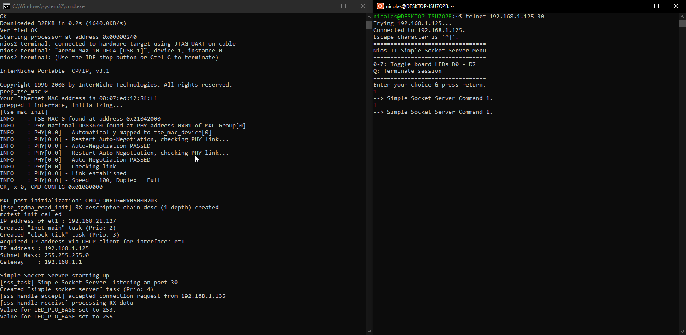
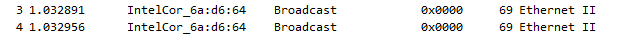
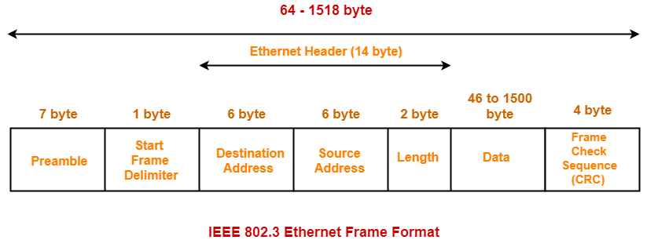
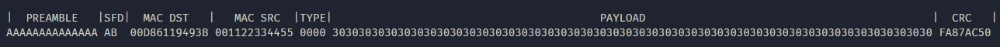

# Introduction

bla bla bla

# Testing the connection

## Working example
One of the first thing I did with the FPGA was to test the setup with a working example. I used the **DECA_socket_server example**, which comes with my development board ([Arrow DECA](https://www.arrow.com/fr-fr/products/deca/arrow-development-tools)). The example worked nicely, I could connect to my board using telnet, and send commands to toggle LEDs. 



## Loopback

Using an example without looking at the code did not help me to understand what I needed to do. The main question for me was : **Do I need to configure the PHY chip or is it ready to go with it's basic config ?** An easy test to figure that out was to send back what was received. To do that, I crafted an ethernet packet using [scapy](https://scapy.readthedocs.io/en/latest/index.html) and then monitored my ethernet interface with Wireshark.

### Packet Creation

Using scapy, I created a basic Ethernet packet :
```Py
>>> conf.ifaces
Source   Index  Name                                       MAC                IPv4            IPv6
libpcap  1      Software Loopback Interface 1              00:00:00:00:00:00  127.0.0.1       ::1
libpcap  10     WAN Miniport (Network Monitor)
libpcap  14     Microsoft Wi-Fi Direct Virtual Adapter     IntelCor:6a:d6:65  169.254.82.207  fe80::61e9:b2fc:c4a2:52cf
libpcap  16     Intel(R) Wireless-AC 9260 160MHz           IntelCor:6a:d6:64  192.168.1.135   fe80::18bf:6035:e20f:891e
libpcap  19     WAN Miniport (IPv6)
libpcap  20     WAN Miniport (IP)
libpcap  3      Intel(R) I211 Gigabit Network Connection   Micro-St:19:49:3b  169.254.68.232  fe80::188c:1570:a552:44e8
libpcap  51     Hyper-V Virtual Ethernet Adapter           Microsof:fd:ee:df  172.29.48.1     fe80::5d67:6079:33ae:3efb
>>> 
>>> 
>>> p = Ether(dst="ff:ff:ff:ff:ff:ff", type=0) / ("Hello Ethernet!" + "0"*40)
>>> p
<Ether  dst=ff:ff:ff:ff:ff:ff type=0x0 |<Raw  load='Hello Ethernet!0000000000000000000000000000000000000000' |>>
>>> sendp(p, iface=conf.ifaces.dev_from_index(3))
.
Sent 1 packets.
```
*I added 40 0's inside the packet data to be certain my packet size will be greater than the mininum.*

On Windows, I had to list my interfaces, and specify the interface using it's index when sending the packet (This is probably not the right solution). On Linux, setting iface to `"eth1"` might work fine.

### Reception using wireshark

In wireshark, when you send the packet, you will see 2 identical packets appear. It means, the loopback works and the PHY chip can be used without prior configuration. It is great because I don't have to add MIIM communication and setup the chip.




# Ethernet frame

The Ethernet frame format can be seen in the following figure : 


*Source : (https://www.gatevidyalay.com/ethernet-ethernet-frame-format/)[https://www.gatevidyalay.com/ethernet-ethernet-frame-format/]*

#### Preamble
The Preamble is 7 bytes of alternating 1's and 0's. It's used to synchronize the sender and the receiver(s). 

#### Start Frame Delimiter (SFD)
The SFD indicates that the frame is about to start. It's value is always 0xAB (0b10101011).

#### Destination Address
This field is the MAC address of the destination. The MAC is made of 6 bytes. 3 bytes for the **O**rganisationally **U**nique **I**dentifier (**OUI**) and 3 bytes for the **N**etwork **I**nterface **C**ontroller (**NIC**). The MAC address is unique.

#### Source Address
This field is the MAC address of the source.

#### Length / EtherType
It is used to indicate which protocol is encapsulated in the payload of the frame.

#### Data / Payload
Data that is being sent.

#### Frame Check Sequence (CRC)
The Frame Check Sequence (FCS) is used to check the integrity of the message. It can detect errors, but can't correct them.

## Example frame

The complete frame we are gonna send later is going to look like the one in the picture below. Except that the order of the bits is not right. We will see later that the frame has to be sent **LEAST SIGNIFICANT BIT FIRST**.




# MII

**Describe the MII interface**
- Talk about the byte order
- Talk about the bit order

# Sending a packet

My first goal was to send a simple hardcoded packet every 2 seconds. To achieve this, I made a really small FSM, which only has two states : **IDLE** and **SENDING**.

The sender works by having the hardcoded packet inside a std_logic_vector, a mask is shifted across the vector every falling edge. Once the mask has shifted to the end of the packet, the state machine goes back to it's IDLE state. It's not how I want to do it in the end, but it works for now.

## Debugging

*Debuggin might be easier on Linux. Here's a link if you're on Windows (I have not tested it) : https://www.intel.com/content/www/us/en/support/articles/000005498/network-and-i-o/ethernet-products.html*


https://www.scadacore.com/tools/programming-calculators/online-checksum-calculator/

http://www.sunshine2k.de/coding/javascript/crc/crc_js.html

Obviously, I spent a lot of time debugging. I did not know what the frame was supposed to look like, the one I was looking at during simulation seemed correct. It was not. My FPGA was connected to my computer, sending frames every two seconds, but wireshark was empty. Not a packet in sight. It made it very difficult to find what was the problem. Hopefully, I saw in [this video](https://youtu.be/zTsHbEIOM2A) a way to see packets in wireshark even if the frame or CRC is wrong. 

```
# ethtool -K eth0 rx-fcs on
# ethtool -K eth0 rx-all on
```

Usually the NIC will not give you the FCS/CRC. The first command let's you see the CRC inside wireshark which is really helpful. The second line let's you receive any frame, even if they are not addressed to you. Also very useful, especially if the error is in the destination address.